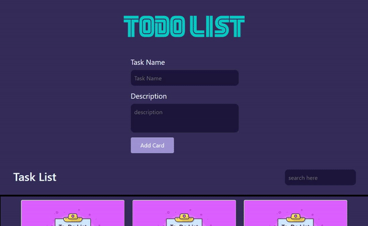
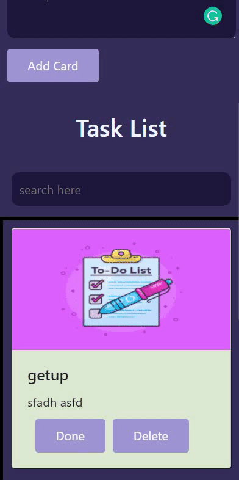

# Tmbill App

> Designed and implemented a production ready application for displaying list of players

> Technology used: `React` , `React-Bootstrap` ``

> Live application can be accessed from : [Live-Demo](https://fayez-tmbill.web.app/)

---

## Table of Contents

- [Installation](#installation)
- [Features](#features)
- [Screencasts](#screencasts)
- [BrowserList](#browserlist)

---

## Installation

> To proceed with smooth installation you should have Node 8+ version installed in your system

> Please navigate to `Tmbill-App` folder and run below command to install `node_modules` in order to run this app locally.

```shell
$ npm install
```

> Once node dependencies are installed then please open `command prompt` and run `npm start` for a development server.
> Navigate to `http://localhost:3000/`.
> The app will automatically reload if you change any of the source files.

> Alternatively, Please have a look on [Live-Demo](https://fayez-tmbill.web.app/)

---

## Features

> Expected functionality:

- Add task
- Delete task
- Mark task as completee
- Search for added task

## Screencasts

> Index Page



---

> Index page Responsive



---

## BrowserList

> Best user experience can be enjoyed on:

- Google Chrome
- Mozilla Firefox
- Safari
- Microsoft Edge

---
